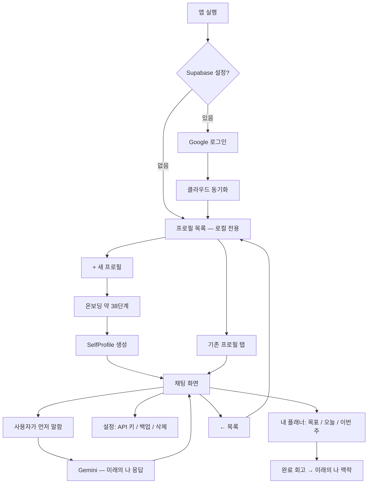
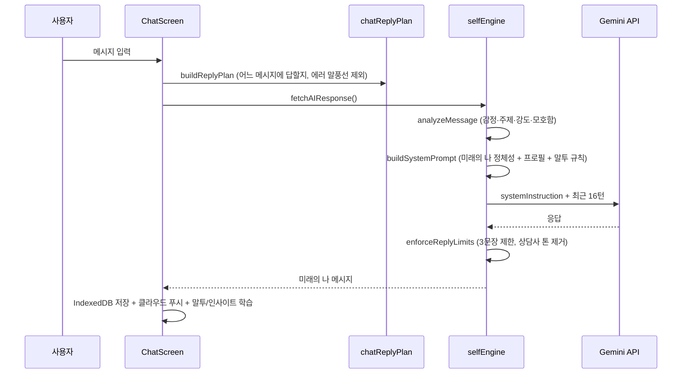

# Future Me

> **대상:** 프로젝트를 처음 보는 사람
> **목적:** "무엇을 만들었는지", "질문은 왜 이렇게 짰는지", "AI는 어떻게 '미래의 나'처럼 말하는지"를 한 번에 이해하기
> **최종 업데이트:** 2026-07-14
> **배포 URL:** [https://futureme-beta.vercel.app](https://futureme-beta.vercel.app)
> **소스:** [https://github.com/jongyoon0130/FutureMe](https://github.com/jongyoon0130/FutureMe)

---

## 1. 한 줄 요약

**Future Me**는 온보딩에서 "지금의 나"와 "5년 뒤 되고 싶은 나"를 입력하면, **Gemini API**가 그 **미래의 나 페르소나**가 되어 카톡처럼 대화해주는 웹앱이다.

- 사람의 의지는 날마다 흔들린다 → **이미 그 길을 지나온 5년 뒤의 나**가 북돋아준다
- 예언·점쟁이가 아니라, "그때는 나도 그랬는데, 지나와 보니 —" 톤의 **경험자**
- 프로필(채팅방) 여러 개, Google 로그인 시 **클라우드 동기화**, 로그인 없이도 로컬 전용으로 동작

> 이 프로젝트는 자문자답 앱 **TalkBack(톡백)** 을 포크해 방향을 바꾼 것이다. 코드 곳곳의
> `talkback-*`/`aime-*` 상수는 구버전 데이터 마이그레이션용이니 지우면 안 된다.

---

## 2. 왜 이렇게 만들었는가 (설계 의도)

| 목표 | 구현 방식 |
| --- | --- |
| 흔들리는 의지를 붙잡아주는 존재 | AI가 "5년 뒤 목표에 도달한 나"로서 담담하게 말함 (`buildSystemPrompt`) |
| 미래가 생생해야 힘이 됨 | 온보딩에서 평범한 하루(typicalDay), 도달 경로(throughline)까지 구체적으로 수집 |
| 말투가 진짜 나 같아야 함 | 말투 샘플 수집 + 자동 분석(stylometry), 채팅할수록 학습 |
| 자기이해 → 용기 → 실행 | 고민 저장, "작은 행동" 제안·격려(courage 모드), 미래의 나 메모 |
| 긴 대화도 맥락 유지 | 최근 16턴 원문 + 이전 대화는 AI 요약으로 압축 |
| 데이터 신뢰 | 삭제 기록(tombstone)으로 "지운 프로필이 되살아나지 않게" 보장, 동기화 실패 시 배너 표시 |

**플래너:** 목표를 `왜 이루려는지 · 이룬 모습 · 5년 뒤의 나와의 연결 · 기간`으로 저장하고, 오늘·이번 주의 행동과 완료 회고로 이어간다. AI는 마일스톤과 이번 주 행동을 **초안으로만 제안**하며, 사용자가 확인하기 전에는 어떤 일정도 저장하지 않는다. 계획을 대신 통제하는 방향은 의도적으로 배제한다.

---

## 3. 사용자 관점 — 앱이 어떻게 흐르는가



**중요한 UX 결정**

- 채팅 시작 시 **자동 인사 없음** → 사용자가 먼저 말해야 함 (몰입감)
- 온보딩 중간 저장 → 브라우저 닫아도 이어서 가능
- 프로필 삭제는 해당 채팅방만 삭제되고, **삭제 기록이 남아** 다른 기기와의 동기화에서도 되살아나지 않음

---

## 4. 온보딩 — 핵심 15문항 + 심화 24문항 (2단 구조)

질문 흐름은 [src/lib/onboardingConfig.ts](src/lib/onboardingConfig.ts)의 `ONBOARDING_STEPS`로 정의되고, UI는 [ChatOnboarding.tsx](src/components/onboarding/ChatOnboarding.tsx)가 그린다.

**핵심 코스 (15단계):** 이름 → 나이 → 역할·상황 → 하루하루 → 신경 쓰이는 영역(칩) → **말투 학습 샘플** → 대화 톤 → (미래 전환) → 정체성 한 문장 → 잘 풀렸으면 하는 영역 → **평범한 하루(생생함)** → **미래의 나 말투 샘플** → 편지(adviceLine) → 이번 주 작은 행동 → **분기: "지금 미래의 나 만나기" vs "더 깊게 만들기"**

**심화 코스 (24단계):** 절대 못 놓는 것 → "잘 산다"의 정의 → 가치관 딜레마 → 힘들었던 순간 → 두려움 → 진짜 원하는 것 → 1년 뒤 성장상 → **도달 경로(throughline)** → 직업/루틴/돈/관계/건강/사는 곳 → 성취 → 넘어선 어려움 → 배운 것 → 피하고 싶은 미래 → 될 뻔했던 길 → 별거 아니었던 걱정 → 변한 성격 → 자아 연속성 → 자주 물을 주제

핵심 코스는 [personaModel.ts](src/lib/personaModel.ts)의 **core 티어**(없으면 페르소나가 남처럼 말하는 필드)를 채우는 최소 질문이다. 건너뛴 질문은 프로필의 **페르소나 채우기**(충실도 % + 추천 질문)에서 언제든 이어서 채울 수 있고, 답변은 말투 학습에도 반영된다.

설계 원리: 미래를 **한 줄 목표**가 아니라 **하루의 장면과 도달 서사**로 쓰게 하면 페르소나가 살아난다. 질문을 바꾸려면 `ONBOARDING_STEPS` 배열만 수정하면 된다.

---

## 5. 데이터 모델 ([src/types/self.ts](src/types/self.ts))

```
SelfProfile ─── 프로필(채팅방) 하나의 전체 데이터
├─ 지금의 나: name, age, currentRole, lifeContext, concernDomains,
│             fear/desire/avoidance/growthDirection, corePriority, successDef …
├─ future: FutureSelfProfile ─── 5년 뒤의 나
│   identityLine, typicalDay, throughline, career, income, relationship,
│   health, achievement, obstacleOvercome, lesson, fearedSelves,
│   futureVoiceSample, adviceLine(+adviceTone), weeklyAction …
├─ 말투: styleSamples(원문) + styleRules(자동 분석 규칙서)
├─ 대화 축적: insights(잠정 관찰), conversationSummary(오래된 대화 요약)
├─ 성장 액션: savedDilemmas(고민), smallActions(작은 행동), futureSelfNotes(메모)
└─ 플래너: goals(목표), milestones(마일스톤), tasks(오늘·주간 행동), reflections(완료 회고)
```

구버전(필드 구조가 다른) 프로필은 `normalizeFutureSelf()`가 자동 변환한다.

---

## 6. AI — "미래의 나"는 어떻게 만들어지는가

핵심 파일: [src/lib/selfEngine.ts](src/lib/selfEngine.ts)

### 6-1. 한 턴의 처리 흐름



### 6-2. 시스템 프롬프트 (`buildSystemPrompt`)

- **정체성:** "너는 ○○의 5년 뒤(N세) 미래의 나다. AI·상담사·점쟁이가 아니다." 예언 금지, "지나와 보니 —" 톤 강제
- **동적 블록:** 이번 말 분석 결과, 미래 프로필 전체(`describeFutureSelf`), 말투 규칙, 대화 요약, 인사이트
- **답변 모드** (`ReplyMode`): `future`(기본 — 미래의 나 관점) · `courage`(작은 행동 밀어주기) · `reflect`(순수 반영)
- **길이·금지:** 한 턴 최대 3문장, 번호·불릿 금지, user 말 되풀이 금지

### 6-3. 메모리 2단 구조

| 구간 | 처리 |
| --- | --- |
| 최근 16메시지 (lite 모드 10) | API에 원문 전송 |
| 36턴 초과분 | `updateConversationSummary`가 16턴마다 AI 요약으로 압축 |
| 24턴마다 | `analyzeInsightsWithAI`가 가치관·상황을 JSON으로 추론해 축적 |

API 키가 없으면 `generateLocalResponse()`가 규칙 기반 짧은 답으로 대체한다.

---

## 7. 저장·동기화 구조

| 데이터 | 저장소 | 키/구조 |
| --- | --- | --- |
| 프로필 목록 인덱스 | localStorage | `futureme-profiles-index` |
| 프로필 본문 | localStorage | `futureme-profile-{id}` |
| **삭제 기록 (tombstone)** | localStorage | `futureme-profile-tombstones` (180일 후 자동 정리) |
| Gemini API 키·모델 | localStorage | `futureme-gemini-key`, `futureme-gemini-model` — **클라우드에 올라가지 않음** |
| 채팅 전체 기록 | IndexedDB `futureme` | store `chat`, key = `profileId` |
| 온보딩 중간 진행 | localStorage | `futureme-onboarding-v4` |
| 클라우드 (로그인 시) | Supabase | `futureme_profiles`, `futureme_chats`, `futureme_settings` (RLS로 본인만 접근) |

### 동기화 규칙 ([src/lib/syncOrchestrator.ts](src/lib/syncOrchestrator.ts))

1. 로그인하면 로컬 vs 클라우드를 비교: 한쪽만 있으면 그쪽을 복사, 둘 다 있으면 **updated_at이 최신인 쪽이 승리** (프로필 단위)
2. **삭제는 tombstone으로 전파**: 프로필을 지우면 클라우드 행을 없애는 대신 `{ __deleted: true, deletedAt }` 표식으로 바꾼다. 병합 때 "삭제 시각 vs 수정 시각, 늦은 쪽이 이긴다"(`deletionWins`) — 삭제 후 다른 기기에서 대화를 이어갔다면 부활, 아니면 모든 기기에서 삭제 유지
3. 클라우드 저장이 실패하면 화면 상단에 **"클라우드 저장 실패" 배너**가 뜨고, 다음 저장·동기화 때 자동 재시도된다 ([src/lib/syncStatus.ts](src/lib/syncStatus.ts))

주의: 채팅은 프로필 단위로 통째로 비교되므로, 두 기기에서 **동시에** 같은 프로필과 대화하면 늦게 저장한 쪽만 남는다. (메시지 단위 병합은 미구현 — §11)

---

## 8. 기술 스택 & 실행

| 항목 | 선택 |
| --- | --- |
| 프레임워크 | React 19 + TypeScript |
| 빌드 | Vite 8 |
| 스타일 | Tailwind CSS 4 |
| 패키지 매니저·테스트 | Bun (`bun test` 내장 러너) |
| AI | Google Gemini API (REST, 브라우저에서 직접 호출, 기본 `gemini-3-flash-preview`) |
| 로그인·DB | Supabase (Google OAuth + Postgres, 선택 사항) |
| 호스팅 | Vercel (`dist` 정적 배포) |

```bash
cp .env.example .env   # Supabase 쓰려면 값 입력, 로컬 전용이면 그대로 둬도 됨
bun install
bun run dev            # http://localhost:5173
bun test               # 테스트 (tests/)
bun run build          # 타입검사 + dist 생성
bun run lint           # Oxlint
```

- Supabase·Google 로그인 설정: [docs/SUPABASE_SETUP.md](docs/SUPABASE_SETUP.md)
- AI 답변을 받으려면 앱 안 ⚙️ 설정에서 **본인 Gemini API 키**를 입력해야 한다 (키는 기기에만 저장)
- 로컬(localhost)과 배포 URL의 로컬 데이터는 분리된다 — 옮기려면 Google 로그인 동기화 또는 백업 JSON

---

## 9. 주요 파일 지도

| 파일 | 역할 |
| --- | --- |
| [src/App.tsx](src/App.tsx) | 화면 전환: 목록 ↔ 온보딩 ↔ 채팅, 동기화 배너 |
| [src/types/self.ts](src/types/self.ts) | 데이터 모델 (SelfProfile, FutureSelfProfile) ★먼저 읽기 |
| [src/lib/onboardingConfig.ts](src/lib/onboardingConfig.ts) | 온보딩 질문 정의 — 핵심/심화 2단 (질문 수정은 여기) |
| [src/lib/personaModel.ts](src/lib/personaModel.ts) | ★페르소나 구조화: facet×tier, 충실도, 빈 곳 추천, 프롬프트 렌더링 |
| [src/lib/selfEngine.ts](src/lib/selfEngine.ts) | 프롬프트 조립, Gemini 호출, 말투 분석, 답변 후처리 ★핵심 |
| [src/lib/plannerStore.ts](src/lib/plannerStore.ts) | 플래너: 목표·마일스톤·작업·회고 (순수 함수) |
| [src/lib/planSuggestionEngine.ts](src/lib/planSuggestionEngine.ts) | 목표 → 이번 주 행동 AI 초안 (JSON 검증 포함) |
| [src/components/planner/PlannerScreen.tsx](src/components/planner/PlannerScreen.tsx) | 플래너 화면: 오늘/이번 주/목표 탭 |
| [src/lib/storage.ts](src/lib/storage.ts) | localStorage CRUD, tombstone, 백업, 구버전 마이그레이션 |
| [src/lib/chatDb.ts](src/lib/chatDb.ts) | IndexedDB 채팅 기록 |
| [src/lib/cloudSync.ts](src/lib/cloudSync.ts) | Supabase 읽기/쓰기 + tombstone 행 |
| [src/lib/syncOrchestrator.ts](src/lib/syncOrchestrator.ts) | 로컬↔클라우드 병합 규칙 |
| [src/lib/syncStatus.ts](src/lib/syncStatus.ts) | 클라우드 저장 실패 상태 (UI 배너용) |
| [src/lib/chatReplyPlan.ts](src/lib/chatReplyPlan.ts) | 어떤 메시지에 답할지·재시도 계획 |
| [src/lib/growthStore.ts](src/lib/growthStore.ts) | 고민/작은 행동/메모 (순수 함수) |
| [src/components/chat/ChatScreen.tsx](src/components/chat/ChatScreen.tsx) | 채팅 UI, API 호출, 설정, 백업 |
| [src/components/onboarding/ChatOnboarding.tsx](src/components/onboarding/ChatOnboarding.tsx) | 온보딩 대화 UI |
| [tests/](tests/) | bun test — 응답 계획·tombstone 병합 규칙 |
| [supabase/schema.sql](supabase/schema.sql) | DB 테이블 + RLS 정책 |

**읽는 순서 추천 (신규 개발자):** §3 흐름 → `types/self.ts` → `onboardingConfig.ts` → `selfEngine.ts`의 `buildSystemPrompt` → `ChatScreen.tsx` → `storage.ts`+`syncOrchestrator.ts`

---

## 10. 용어 정리

| 용어 | 의미 |
| --- | --- |
| SelfProfile | 채팅방 하나의 전체 프로필 (지금의 나 + future) |
| 미래의 나 / self | AI가 말하는 쪽 (`role: 'self'`) |
| throughline | 지금→5년 뒤에 도달한 경로 서사 ("future memory") |
| 레지스터 | 말하는 상황 (일상/성찰/토로/기쁨/위로) |
| stylometry | 텍스트에서 말투 규칙(반말, 어미, ㅋㅋ 빈도 등) 자동 추출 |
| insight | 대화에서 조심스럽게 쌓는 잠정 관찰 |
| tombstone | 삭제 기록 — 지운 프로필이 동기화로 되살아나지 않게 하는 표식 |
| ReplyMode | 답변 관점 (future/courage/reflect) |

---

## 11. 한계 & 다음 단계

> 상세 계획: [docs/ROADMAP.md](docs/ROADMAP.md) — 페르소나 × 플래너 로드맵과 우선순위

| 현재 한계 | 방향 |
| --- | --- |
| Gemini API 키를 사용자가 직접 발급·입력 | 서버 프록시 + 사용량 관리 (키 노출 위험 제거) |
| 채팅 병합이 프로필 단위 (동시 편집 시 한쪽 유실) | 메시지 단위 병합 |
| 플래너와 대화의 연결이 아직 단방향 위주 | 완료 회고→대화 공급, 채팅 행동→플래너 승격 (P1) |
| AI 계획 초안이 사용자 리듬을 모름 | 완료율·미룸 데이터를 제안 프롬프트에 반영 (P1) |
| localStorage 용량(~5MB) 한계 | 프로필 본문도 IndexedDB로 이전 |

---

*코드 변경 시* `ONBOARDING_STEPS`*,* `buildSystemPrompt`*, 저장 키, 동기화 규칙과 함께 이 README도 갱신할 것.*
