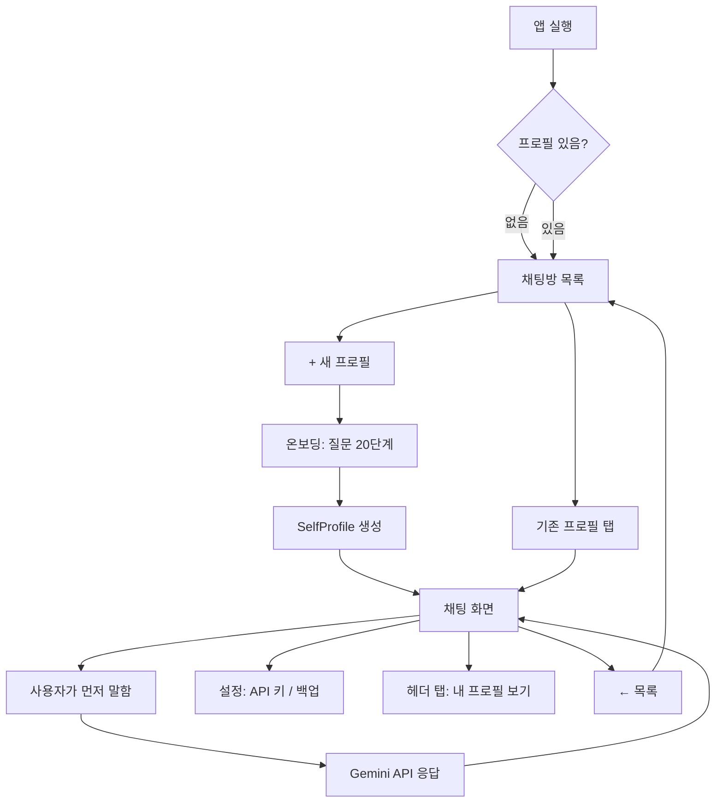
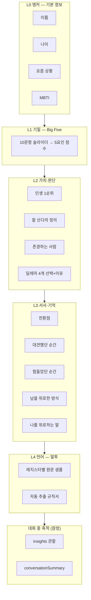
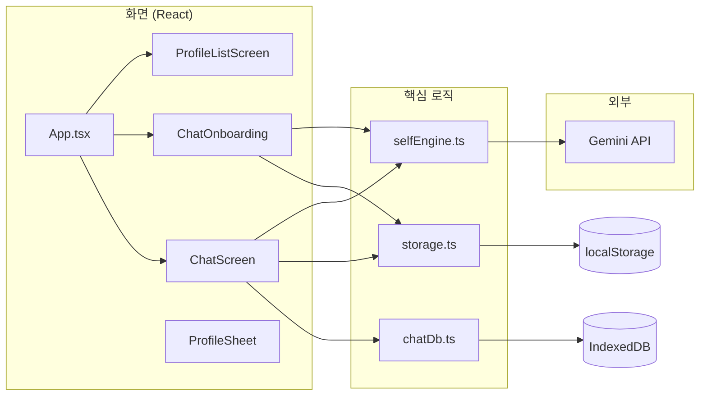
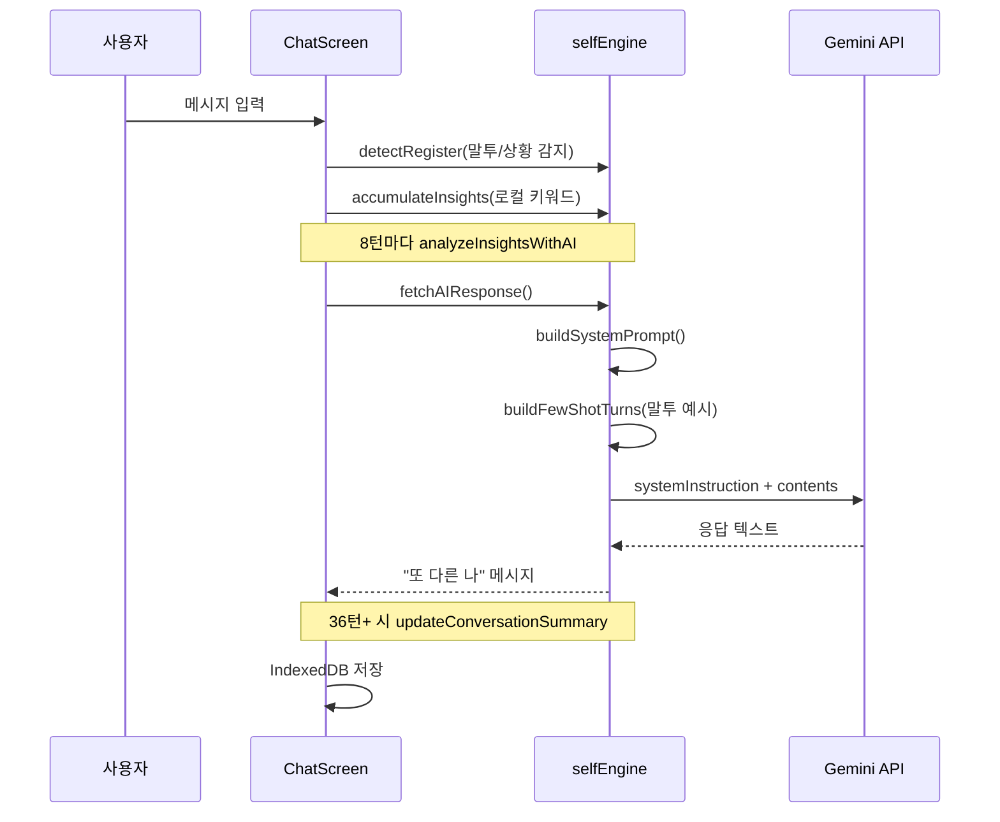

# 아TalkBack (톡백)

> **대상:** 프로젝트를 처음 보는 사람  
> **목적:** “무엇을 만들었는지”, “질문은 왜 이렇게 짰는지”, “AI는 어떻게 ‘나’처럼 말하는지”를 한 번에 이해하기  
> **최종 업데이트:** 2026-07-06  
> **배포 URL:** [https://talkback-beta.vercel.app](https://talkback-beta.vercel.app)  
> **소스:** [https://github.com/jongyoon0130/TalkBack](https://github.com/jongyoon0130/TalkBack)

---

## 1. 한 줄 요약

**TalkBack(톡백)** 은 사용자가 온보딩에서 자신에 대한 정보를 입력하면, 그 데이터를 바탕으로 **Gemini API**가 “또 다른 나”처럼 말하는 **자문자답 채팅 웹앱**이다.

- 서버·DB 없음 → **브라우저(localStorage + IndexedDB)** 에만 저장
- API 키도 **각 사용자가 직접 입력** (코드에 키를 넣지 않음)
- 카카오톡처럼 **프로필(채팅방) 여러 개** 가능

---

## 2. 왜 이렇게 만들었는가 (설계 의도)


| 목표                      | 구현 방식                                              |
| ----------------------- | -------------------------------------------------- |
| 부담 없이 쓰는 일상 도구          | 카톡형 UI, 가벼운 색·폰트, 채팅방 목록                           |
| “AI 챗봇”이 아니라 **나와의 대화** | 프롬프트에서 1인칭 자기 대화 구조 강조, UI에서 “복제 AI” 문구 최소화        |
| 말투가 진짜 나 같아야 함          | 온보딩에서 **친구에게 톡 보내듯** 쓰라고 안내 + 말투 자동 분석(stylometry) |
| 성격·가치관까지 반영             | McAdams 3층 + 언어층 모델로 프로필 데이터 구조화                   |
| 긴 대화도 맥락 유지             | 최근 24턴은 원문, 그 이전은 **AI 요약**으로 압축                   |
| 개인정보·비용                 | 로컬 저장, API 키 사용자 보유, 백업 JSON 내보내기/가져오기             |


---


## 3. 사용자 관점 — 앱이 어떻게 흐르는가




**중요한 UX 결정**

- 채팅 시작 시 **자동 인사 없음** → 사용자가 먼저 말해야 함 (몰입감)
- 온보딩 중간 저장 → 브라우저 닫아도 이어서 가능
- 프로필 삭제는 **해당 채팅방만** 삭제 (다른 프로필 유지)

---


## 4. “나”를 표현하는 데이터 구조 (4층 모델)

프로필(`SelfProfile`)은 심리학의 **McAdams 정체성 3층** + **말투(언어) 층**으로 설계했다.




**레지스터(Register)** — 같은 사람도 상황에 따라 말투가 다르다는 전제:


| 레지스터       | 의미    | 온보딩에서 쓰는 예시 필드    |
| ---------- | ----- | ----------------- |
| casual     | 일상    | 요즘 뭐 하면서 지내       |
| reflective | 성찰·고민 | 인생 1순위, 잘 산다의 정의  |
| venting    | 토로    | 힘들었던 순간           |
| joyful     | 기쁨    | 대견했던 순간           |
| comforting | 위로    | 위로해준 기억, 듣고 싶은 위로 |


---


## 5. 온보딩 질문 — 순서와 의도

온보딩은 `ChatOnboarding.tsx`의 `STEPS` 배열로 정의된다.  
**설계 원칙:** 가벼운 사실 → 성격 → 가치관 → 깊은 서사 → 위로 (초반 워밍업 후 감정적으로 깊어짐)

### 5-1. 전체 질문 순서표


| #     | 유형       | 질문 요지                       | 저장 필드           | 레지스터       |
| ----- | -------- | --------------------------- | --------------- | ---------- |
| 1     | 이름       | 뭐라고 부를까? (친구한테 톡하듯 써달라는 안내) | `name`          | —          |
| 2     | 나이       | 몇 살?                        | `age`           | —          |
| 3     | MBTI     | 알면 선택, 모르면 스킵               | `mbti`          | —          |
| 4     | 서술       | 요즘 뭐 하면서 지내?                | `lifeContext`   | casual     |
| 5     | Big Five | 10문항 슬라이더 (1~7)             | `bigFive`       | —          |
| 6     | 서술       | 인생에서 절대 못 놓는 1순위 + 이유       | `corePriority`  | reflective |
| 7–8   | 딜레마 1    | 안정 vs 하고 싶은 길 → 왜?          | `dilemmas[0]`   | reflective |
| 9–10  | 딜레마 2    | 친구가 틀렸을 때 → 왜?              | `dilemmas[1]`   | reflective |
| 11–12 | 딜레마 3    | 갈등 시 반응 → 왜?                | `dilemmas[2]`   | reflective |
| 13–14 | 딜레마 4    | 목돈 생기면 → 왜?                 | `dilemmas[3]`   | reflective |
| 15    | 서술       | “잘 산다”는 어떤 삶?               | `successDef`    | reflective |
| 16    | 서술       | 닮고 싶은/존경하는 사람 (선택)          | `admire`        | reflective |
| 17    | 서술       | 나를 만든 결정적 순간                | `turningPoint`  | reflective |
| 18    | 서술       | 스스로 대견했던 때                  | `proudMoment`   | joyful     |
| 19    | 서술       | 최근 제일 힘들었던 것                | `stressMoment`  | venting    |
| 20    | 서술       | 힘든 사람에게 뭐라고 해줬는지 (선택)       | `comfortMemory` | comforting |
| 21    | 서술       | 힘들 때 듣고 싶은 위로               | `comfortTarget` | comforting |


### 5-2. Big Five 10문항 (TIPI 스타일)

각 요인당 2문항, 역채점 포함 → 5요인 점수 산출 (`scoreBigFive`)


| 요인  | 문항 예                           |
| --- | ------------------------------ |
| 개방성 | 새로운 아이디어에 끌린다 / 익숙한 방식이 편하다(역) |
| 성실성 | 계획하고 끝까지 지킨다 / 즉흥적(역)          |
| 외향성 | 사람과 어울리면 에너지 / 혼자가 회복(역)       |
| 우호성 | 상대 입장 공감 / 내 의견 밀어붙임(역)        |
| 신경성 | 걱정·불안 자주 / 감정 안 흔들림(역)         |


### 5-3. 딜레마 4가지

`types/self.ts`의 `DILEMMA_SPECS`:

1. **안정 vs 하고 싶은 길**
2. **친구가 틀렸을 때 — 지적 vs 넘어감**
3. **갈등 시 — 감정 먼저 / 논리 먼저 / 피하고 시간**
4. **목돈 — 저축 / 경험 / 나눔**

→ 선택 + 이유를 함께 받아 **가치관·판단 패턴**을 L2에 저장한다.

### 5-4. 온보딩 완료 후 처리

1. 서술형 답변 → `styleSamples` (레지스터별 원문)
2. `extractStyleRules()` → 반말/존댓말, 문장 길이, ㅋㅋ/이모지, 자주 쓰는 어미·필러 등 **말투 규칙서** 생성
3. `SelfProfile` 저장 → 채팅 화면으로 이동

---


## 6. 기술 구조 — 코드는 어디에 있는가




### 6-1. 주요 파일 역할


| 파일                                             | 역할                                   |
| ---------------------------------------------- | ------------------------------------ |
| `src/App.tsx`                                  | 화면 전환: 목록 ↔ 온보딩 ↔ 채팅                 |
| `src/types/self.ts`                            | 데이터 모델, Big Five·딜레마 상수              |
| `src/lib/selfEngine.ts`                        | 점수 계산, 말투 분석, **프롬프트 조립**, Gemini 호출 |
| `src/lib/storage.ts`                           | 프로필 CRUD, API 키, 백업 JSON             |
| `src/lib/chatDb.ts`                            | 프로필별 채팅 전체 기록 (IndexedDB)            |
| `src/lib/brand.ts`                             | 앱명 `톡백`, 태그라인                        |
| `src/components/onboarding/ChatOnboarding.tsx` | 온보딩 질문 흐름                            |
| `src/components/chat/ChatScreen.tsx`           | 채팅 UI, API 호출, 인사이트·요약 갱신            |


### 6-2. 데이터 저장 위치


| 데이터             | 저장소                  | 키/구조                                           |
| --------------- | -------------------- | ---------------------------------------------- |
| 프로필 목록 인덱스      | localStorage         | `talkback-profiles-index`                      |
| 프로필 본문          | localStorage         | `talkback-profile-{id}`                        |
| Gemini API 키·모델 | localStorage         | `talkback-gemini-key`, `talkback-gemini-model` |
| 채팅 전체 기록        | IndexedDB `talkback` | store `chat`, key = `profileId`                |
| 온보딩 중간 진행       | localStorage         | `talkback-onboarding-progress`                 |


> 구버전 `aime-*` localStorage 키도 **자동 마이그레이션** 지원.

---


## 7. AI / 프롬프트 — “또 다른 나”는 어떻게 만들어지는가

핵심 파일: `src/lib/selfEngine.ts`

### 7-1. 한 턴의 처리 흐름




### 7-2. 시스템 프롬프트 구성 (`buildSystemPrompt`)

프롬프트는 **고정 규칙** + **프로필에서 끌어온 동적 블록**으로 조립된다.


| 섹션          | 내용                       | 출처                              |
| ----------- | ------------------------ | ------------------------------- |
| 대화 구조       | “같은 나와의 1인칭 대화”, 너/당신 금지 | 고정                              |
| 지금 상황       | venting/joyful/… 가이드     | `detectRegister()`              |
| 기본 정보       | Big Five 요약, 나이, 요즘 상황   | L0, L1                          |
| 중요하게 여기는 것  | 1순위, 잘 산다, 존경            | L2                              |
| 선택으로 드러난 판단 | 딜레마 선택+이유                | L2                              |
| 이 사람을 이해할 때 | Big Five → 자연어 서술        | `describePersonUnderstanding()` |
| 배경 기억       | 전환점·자부심 등 (억지로 꺼내지 말 것)  | L3                              |
| 대화 요약       | 오래된 턴 압축본                | `conversationSummary`           |
| 대화에서 알게 된 것 | insights (잠정)            | L5                              |
| 말투 규칙       | 반말/존댓말, 어미, 필러 등         | L4 `styleRules`                 |
| 길이·금지사항     | 2~4문장, 상담사 톤 금지 등        | 고정                              |


**핵심 철학 (프롬프트에 명시):**

- user 턴 = **내 속마음** (`[나의 속마음]` 접두어로 API에 전달)
- model 턴 = **같은 나**가 다른 각도에서 되비침
- ❌ “그런 배짱 부러워” (남처럼 칭찬)
- ✅ “그런 배짱? 있는 것도 다행이다” (자기 안에서 인정)


### 7-3. Few-shot 말투 모방 (`buildFewShotTurns`)

온보딩에서 모은 **실제 사용자 원문**을 대화 턴 형식으로 API `contents` 앞에 붙인다.

```
user:  [나의 속마음] 하... 나 요즘 좀 힘들다
model: (온보딩에서 쓴 stressMoment 원문)
```

→ Gemini가 문체·어미·리듬을 **모방**하도록 유도.

### 7-4. 말투 자동 분석 (`extractStyleRules`)

온보딩 + 이후 채팅에서 쌓인 `styleSamples` 텍스트를 분석:

- 존댓말 비율 → 반말/존댓말
- 평균 문장 길이
- ㅋㅋ/ㅠㅠ, 이모지, 느낌표, 말줄임 빈도
- 자주 쓰는 종결어미·필러 (예: 거든, 잖아, 그냥, 뭔가)


### 7-5. 보조 AI 호출 (같은 API, 다른 system prompt)


| 함수                          | 목적             | 트리거             |
| --------------------------- | -------------- | --------------- |
| `fetchAIResponse`           | 채팅 응답          | 매 사용자 메시지       |
| `updateConversationSummary` | 오래된 대화 요약      | 36턴+ & 16턴마다 갱신 |
| `analyzeInsightsWithAI`     | 가치관·상황 추론 JSON | 8턴마다            |


**메모리 2단 구조:**

- **최근 24메시지** → API에 원문 전송
- **그 이전** → `conversationSummary`에 AI 요약 (최대 ~900자)


### 7-6. API 키 없을 때

`generateLocalResponse()` — 규칙 기반 짧은 fallback (Gemini 미사용)

---


## 8. 채팅 화면 부가 기능


| 기능       | 설명                                 |
| -------- | ---------------------------------- |
| API 키 설정 | `verifyApiKey()`로 저장 전 검증          |
| 모델 선택    | 기본 `gemini-2.5-flash`              |
| 백업 내보내기  | `talkback-backup-{이름}-{날짜}.json`   |
| 백업 가져오기  | 프로필+메시지 덮어쓰기                       |
| 프로필 시트   | 온보딩에 입력한 값 조회 (헤더 탭)               |
| 프로필 삭제   | 해당 ID의 localStorage + IndexedDB 삭제 |


---


## 9. 기술 스택 & 배포


| 항목      | 선택                                     |
| ------- | -------------------------------------- |
| 프레임워크   | React 19 + TypeScript                  |
| 빌드      | Vite 8                                 |
| 스타일     | Tailwind CSS 4                         |
| 패키지 매니저 | Bun                                    |
| AI      | Google Gemini API (REST, 브라우저에서 직접 호출) |
| 호스팅     | Vercel (`dist` 정적 배포)                  |


**로컬 개발**

```bash
bun install
bun run dev    # http://localhost:5173
```

**빌드**

```bash
bun run build
bun run preview   # dist 미리보기
bun run lint      # Oxlint
```

**주의:** 로컬과 웹(Vercel) URL의 데이터는 **서로 공유되지 않음**. 옮기려면 백업 JSON 사용.

---


## 10. 용어 정리


| 용어            | 의미                         |
| ------------- | -------------------------- |
| SelfProfile   | 한 “채팅방(나)”의 전체 프로필 데이터     |
| 또 다른 나 / self | AI가 말하는 쪽 (`role: 'self'`) |
| 레지스터          | 말하는 상황(일상/토로/위로 등)         |
| insight       | 대화 중 조심스럽게 쌓는 잠정 관찰        |
| stylometry    | 텍스트에서 말투 통계 추출             |
| few-shot      | API 앞에 붙이는 말투 예시 대화        |


---


## 11. 읽는 순서 추천 (신규 개발자)

1. **§3** — 사용자 흐름
2. `src/types/self.ts` — 데이터가 뭔지
3. `ChatOnboarding.tsx`의 `STEPS` — 어떤 질문을 하는지
4. `selfEngine.ts`의 `buildSystemPrompt` — AI가 어떻게 “나”가 되는지
5. `ChatScreen.tsx` — 실제 API 호출·저장 타이밍
6. `storage.ts` + `chatDb.ts` — 어디에 저장되는지

---


## 12. 한계 & 향후 확장 아이디어 (참고)


| 현재 한계                | 가능한 개선             |
| -------------------- | ------------------ |
| API 키를 사용자가 직접 발급    | 서버 프록시 + 사용량 관리    |
| 브라우저별 데이터 분리         | 계정·클라우드 동기화        |
| Gemini만 지원           | 다른 LLM 어댑터         |
| insights는 휴리스틱+가끔 AI | 정기 fine-tune / RAG |


---

*코드 변경 시* `STEPS`*,* `buildSystemPrompt`*, 저장 키 이름과 함께 이 README도 갱신하는 것을 권장한다.*